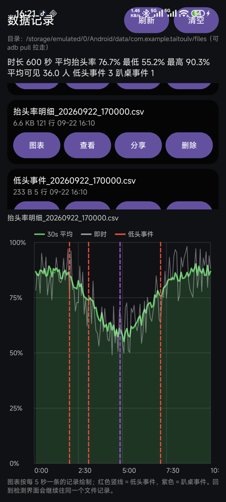

# 抬头率检测 · Android 端

用手机摄像头实时统计课堂**抬头率 / 趴桌率**的 Android 应用：完全离线的 ML Kit 人脸检测 → 头姿判定 → 行为事件统计 → CSV 记录与曲线可视化。

-3DDC84?logo=android&logoColor=white)


## 功能特性

- **完全离线**：人脸检测模型随 APK 打包，不联网、不上传任何画面，也不做人脸身份识别；
- **实时判定**：抬头 / 低头 / 趴桌 / 闭眼，画面上绿 / 红 / 紫三色框 + 俯仰角标签；
- **行为事件统计**：按 `trackingId` 跟人，连续低头 ≥5s、趴桌 ≥10s 才记一次事件（避免单帧抖动），跟丢与退出都会收尾；
- **窗口抬头率**：界面大数字是 30s 滑动平均（按人数加权），另给即时值；
- **手动记录**：点「开始记录」才写 CSV（明细每 5s 一行 + 事件表），「停止记录」先收尾事件再关文件；
- **数据页**：文件列表 / 查看 / 分享（任意 App）/ 删除 / 清空，外加自绘抬头率曲线（30s 平均 + 即时 + 事件竖线）；
- **多镜头**：运行时枚举手机摄像头（含超广角 0.6× 档位）并支持 USB 外接摄像头；
- **横竖屏自适应**：横屏沉浸式全屏、点屏幕隐藏控件、Android 15+ 系统栏安全区适配；
- **14 个 JVM 单元测试**：事件状态机 8 个 + CSV 解析/汇总 6 个。

## 截图



*数据页：上方曲线（绿线 30s 平均、灰线即时、红/紫竖线为低头/趴桌事件），下方 CSV 列表与操作。*

## 快速开始

```bash
# 需要 JDK 17+ 与 Android SDK（Android Studio 自带即可）
./gradlew assembleDebug            # 产物：app/build/outputs/apk/debug/app-debug.apk
adb install -r app/build/outputs/apk/debug/app-debug.apk
./gradlew testDebugUnitTest        # 跑单元测试
```

更详细的构建方式、界面说明、判定原理、踩坑记录与部署建议见下文。

## 项目说明

教室/会议室场景下，用手机摄像头实时统计**抬头率**：检测画面里的每一张脸，用头部俯仰角判断抬头还是低头，实时显示「总人数 / 抬头 / 低头 / 抬头率」，并在画面上把人脸框标成绿色（抬头）或红色（低头）。

> **状态：已在 macOS + Android Studio 2026.1（AGP 9.4.1 / Gradle 9.7.1 / JDK 25）编译通过，
> 并已用 adb 装到小米 15（Android 16）上实跑验证**：预览正常、无崩溃、变焦范围识别为 0.6×–10.0×、
> `0.6× 超广角` 的请求确实下发到 HAL（`android.control.zoomRatio = 0.6`）。
> 产物 `TaiTouLv-debug.apk`（47MB，debug 签名，可直接侧载安装）。
>
> 改动历史：① 修检测框偏移（改用 CameraX `ViewPort` + `CoordinateTransform` 做坐标映射）→ 已由你确认对齐；
> ② 支持横竖屏；③ 底部改成运行时枚举的摄像头按钮 + 变焦档位（**广角在这里选**）；
> ④ 横屏：Manifest 声明 `screenOrientation="sensor"`（**无视系统「自动旋转」开关**）+ 独立横屏布局 + 方向按钮；
> ⑤ 修「旋转后检测框与人反向」——改用 CameraX 官方 `MlKitAnalyzer` + `COORDINATE_SYSTEM_VIEW_REFERENCED`（见下文），并重排 UI（面板可滚动、按钮统一尺寸）；
> ⑥ 修「横竖屏切换闪退」——`RejectedExecutionException`：分析线程不能在 Activity 销毁时 `shutdown()`（见下文「闪退排查」）。

- **检测全在本地**：人脸检测模型打包进 APK，检测过程不联网、不上传任何画面
- **不用训练模型**：直接用人脸检测给出的头部欧拉角判断，核心逻辑不到 200 行
- **可现场调参**：底部滑块实时调整「低头阈值」，适配不同座位高度和拍摄角度
- **可选镜头**：手机上每一颗可用摄像头都会列成按钮（含超广角），现场挑视野最合适的那颗


## 判定原理

ML Kit 的人脸检测会为每张脸给出三个欧拉角，其中 `headEulerAngleX` 就是**俯仰角（pitch）**：正值表示下巴上扬（抬头），负值表示下巴下压（低头）。所以：

```
抬头率 = （俯仰角 >= 阈值的脸数） / 检测到的总脸数
```

默认阈值 `-10°`，即"比水平线低 10 度以内都算抬头"。趴桌、写字的姿态一般在 -20° 以下，会被判成低头。

> 注意：抬头率的分母是**当前画面检测到的人数**，不是点名册人数。如果要按班级总人数算（和 PC 版 `IntelljClass` 一致），把 `MainActivity.renderResult()` 里的 `total` 换成一个手动输入或从名单读入的固定值即可。

## 目录结构

```
TaiTouLvAndroid/
├── settings.gradle.kts / build.gradle.kts / gradle.properties
├── gradlew / gradlew.bat / gradle/wrapper/         # Gradle Wrapper（8.9）
└── app/
    ├── build.gradle.kts                            # 依赖与编译配置
    └── src/main/
        ├── AndroidManifest.xml                     # 只申请 CAMERA 权限
        ├── java/com/example/taitoulv/
        │   ├── MainActivity.kt                     # CameraX 绑定 + 界面刷新
        │   ├── FaceAnalyzer.kt                     # 人脸检测 + 抬头/低头判定
        │   └── HeadUpOverlayView.kt                # 画检测框和标签
        └── res/
            ├── layout/activity_main.xml
            ├── drawable/panel_bg.xml, ic_launcher.xml
            └── values/strings.xml, themes.xml
```

## 怎么跑起来

### 方式零：直接装已经编译好的 APK（最快）

```bash
# 手机开 USB 调试并连上电脑，然后（工程根目录就有一份编好的）：
~/Library/Android/sdk/platform-tools/adb install -r TaiTouLv-debug.apk
```

或者把 `TaiTouLv-debug.apk` 直接传到手机（微信文件传输 / 数据线 / 网盘）点击安装。
装完打开「抬头率检测」，允许摄像头权限即可。

### 方式一：Android Studio（改代码时用）

1. 装 Android Studio（[下载页](https://developer.android.com/studio)，自带 JDK 和 Android SDK）
2. `File → Open`，选择本文件夹 `TaiTouLvAndroid`（不是里面的 app 目录）
3. 第一次打开会自动 Gradle Sync 并下载依赖（CameraX、ML Kit，约 100–200MB），等右下角进度条走完
4. 手机用数据线连电脑 → 手机上打开「开发者选项 → USB 调试」→ 在 Android Studio 顶部设备列表里选中手机
5. 点绿色 ▶ Run。首次启动会弹摄像头权限，允许即可

不想连电脑：`Build → Build Bundle(s) / APK(s) → Build APK(s)`，产物在
`app/build/outputs/apk/debug/app-debug.apk`，把这个文件传到手机（微信/数据线/网盘都行）点击安装。

### 方式二：命令行

需要 **JDK 17+** 和 **Android SDK**（`platforms;android-37` + 对应 build-tools；Android Studio 装好就有）。
本机已实测可用的命令（用 Android Studio 自带的 JBR 当 JDK）：

```bash
export JAVA_HOME="/Applications/Android Studio.app/Contents/jbr/Contents/Home"
echo "sdk.dir=$HOME/Library/Android/sdk" > local.properties   # 已生成，换机器时重做

./gradlew assembleDebug          # 产物：app/build/outputs/apk/debug/app-debug.apk
./gradlew installDebug           # 手机已连 USB 调试时可直接安装
```

> 注意：`gradle-wrapper.properties` 里的 `distributionUrl` 我指向了**腾讯云镜像**
> （`mirrors.cloud.tencent.com/gradle/`），因为 `services.gradle.org` 在国内基本下不动。
> 想换回官方，把它改回 `https\://services.gradle.org/distributions/gradle-9.7.1-bin.zip` 即可。

## 界面说明

| 元素 | 说明 |
|---|---|
| 顶部大字 | 当前抬头率 |
| 顶部小字 | 总人数 / 抬头 / 低头 |
| 绿色框 | 判为抬头，框上标着该人脸的俯仰角度数 |
| 红色框 | 判为低头 |
| 摄像头按钮排 | 系统真正开放给 App 的摄像头（如 `后置 83° 主摄`），蓝色为当前选中 |
| 变焦档位排 | `0.6× 超广角` / `1.0×` / `2.0×` / `5.0×` 等，**很多机型的广角只能从这里切** |
| 变焦滑块 | 最左边 = 最小变焦（就是超广角），最右边 = 最大变焦 |
| 阈值滑块 | 低头阈值，-40° ~ +20°，默认 -10° |
| 记录按钮 | `开始记录` / `停止记录`（记录中变红）；默认不写文件 |
| 方向按钮 | `方向自动` / `方向横屏` / `方向竖屏` 三态循环，会记住上次选择 |
| 横竖屏 | 都支持，且**不依赖系统的「自动旋转」开关**；横屏有专门的布局（控件收到右侧竖条） |

**布局要点**（为「横竖屏都显示完整、好操作」做的）：

- **点屏幕隐藏 / 显示控件**：点预览画面任意空白处，底部按钮条 + 右侧滑块面板一起淡出（160ms），中间提示「点屏幕显示控件」1.6s；再点一下恢复。点面板、按钮、滑块本身不会误触切换（这些面板会「吃掉」点击）；**抬头率读数卡片保持常显**，方便随时看结果；显示状态会记住；
- **系统栏安全区**：Android 15（targetSdk 35）起系统**强制 edge-to-edge**，系统栏浮在内容上层——竖屏也不能再靠 `setDecorFitsSystemWindows(true)` 自动内缩，否则抬头率卡片和底部按钮会顶进状态栏/导航栏。现在统一做法：**预览铺满整屏**，只给「统计卡片 / 右侧面板 / 底部按钮条」按 `systemBars ∪ displayCutout` 叠加外边距（`setupWindowInsets()` + `safePanels`）；横屏再额外隐藏系统栏做真全屏；
- **横屏沉浸式真全屏**：隐藏状态栏和导航栏（`WindowCompat.setDecorFitsSystemWindows(false)` + `WindowInsetsControllerCompat.hide(systemBars())`），只给挖孔/刘海留白；从边缘上滑可临时唤出系统栏。竖屏保持正常系统栏；
- **横屏按钮一行排完，不用滑动**：底部按钮条用 `LinearLayout` 权重等分整行，权重按**文字长度**分配（`0.6× 超广角` 拿更大份额，不会被截成 `0.6× 超…`）；右侧面板只放滑块；
- **控件加大**：按钮统一 48dp 高、15sp 文字；滑块换成自绘轨道（10dp 粗）+ 32dp 大把手（`seekbar_track.xml` / `seekbar_thumb.xml`），拖动和点按都更容易；
- **字号加大**：抬头率 36sp（横屏 34sp）、统计行 16sp、滑块说明 15sp；横屏右侧面板窄，阈值说明用短文案避免换行；
- **控件尺寸**：按钮 40dp 高（横屏 42dp）、文字保持 15sp 不缩；面板内边距 10dp、行间距 4dp、滑块外围留白压到 6dp（滑块本体仍是 10dp 粗轨道 + 32dp 大把手）——整体比早期版本紧凑约 15%，不那么占画面；
- 两块控制面板都套在 `ScrollView` 里：屏幕再矮、或者 MIUI 小窗模式下也不会被裁掉；
- **旋转后摄像头选择和变焦倍数会恢复**（存在 `SharedPreferences`），不会一转屏就被重置；
- 坐标变换每 500ms 兜底刷新一次：换摄像头、尺寸变化、系统栏临时显隐都会让 `sensorToViewTransform` 变，`PreviewView` 不保证每次回调。

## 行为统计与数据导出（P0）

从「能跑」到「能出结论」的四件事（都已实现并在真机验证）：

### 1. 跟踪 + 时间窗事件（不看瞬时比例）

- 用 ML Kit 的 `trackingId` 跟住每个人；
- 连续低头 ≥ **5s** 记 1 次**低头事件**；连续「俯仰角 ≤ -35° 且闭眼」≥ **10s** 记 1 次**趴桌事件**（趴桌优先，同一段不重复记低头）；
- 跟丢超过 2s 视为离场，进行中的事件按最后见到的时间收尾；**真正退出 App** 时把进行中的事件一起收尾（转屏走的是 `onDestroy`，用 `isFinishing` 区分，否则一次持续低头会被切成两段）；
- 界面上那个大数字是 **30s 滑动窗口抬头率**（按人数加权，比逐帧比例稳得多），第三行另给即时值。

### 2. 趴桌 / 闭眼（打开关键点与分类）

`FaceDetectorOptions` 打开 `LANDMARK_MODE_ALL` + `CLASSIFICATION_MODE_ALL`，用 `leftEyeOpenProbability / rightEyeOpenProbability` 的较小值判断闭眼（阈值 0.4）。画面上：**绿=抬头、红=低头、紫=趴桌**，闭眼会在标签里标出来（如 `趴桌 -42° 闭眼`）。

### 3. CSV 记录（手动开始/停止，每 5 秒一行 + 事件表）

**默认不记录**：点底部「**开始记录**」才创建文件并开始写（按钮变红显示「停止记录」）；点「停止记录」会**先把进行中的低头/趴桌事件收尾**，再 flush 并关闭文件。
用进程级单例保存状态，所以**转屏不会中断记录**；进程结束则自动回到「未记录」。未记录时状态栏那行显示「未记录 · xx fps」。
文件存在 App 的外部私有目录，**不需要任何存储权限**，文件名带时间戳（记录开始时的时间），也可以直接拉：

```bash
adb pull /sdcard/Android/data/com.example.taitoulv/files/ ./csv/
```

| 文件 | 内容 |
|---|---|
| `抬头率明细_*.csv` | 每 5s 一行：时间、相对秒、可见人数、抬头、低头、趴桌、闭眼、即时/5s/30s 抬头率、最小人脸像素、低头阈值、帧率 |
| `低头事件_*.csv` | 每个事件一行：类型（低头/趴桌）、跟踪ID、开始秒、结束秒、时长秒、最低俯仰角、最低睁眼概率 |

UTF-8 带 BOM（Excel 直接打开不乱码）；每行写完就 flush，进程被杀也不丢数据；「相对秒」是进程级的，转屏重建 Activity 后继续走。

### 4. 最小人脸像素预警 + 帧率上限

- 第三行实时显示 **最小人脸像素**：统一折算到「1280 宽分析图」的尺度（`REFERENCE_ANALYSIS_WIDTH`），跨机型/方向可比；**< 80px 就提示「⚠机位偏远」**，现场部署不用靠猜；
- 分析帧率默认上限 **15fps**（`FaceAnalyzer.DEFAULT_MAX_FPS`，实测约 12）：状态机 2Hz 采样就够，限帧明显降功耗与发热（不限帧时空场景能跑到 119fps，纯浪费）。

### 5. 单元测试（不需要手机）

`AttentionTracker` 是纯逻辑、时间由参数传入，所以判定口径用 JVM 测试钉住了：

```bash
./gradlew testDebugUnitTest
# 8 个用例：≥5s 才算低头事件、<5s 不算、趴桌优先不重复记低头、跟丢收尾、退出收尾、
#          窗口抬头率按人数加权(50%)、空场景不产生窗口值、闭眼与最小人脸像素统计
```

### 局限（写进报告时别踩坑）

- **玩手机不做检测**：手机屏在学生胸前/桌面，10m 外只有几个像素，物理上不可行；对外口径用「低头率 / 趴桌率 / 闭眼率」；
- 完全趴下时脸被挡住会跟丢，这类人**不计入分母**（分母是「可见人数」，不是应到人数）；
- 单机在 60 人以上覆盖不够，需要多机位（见上面机位表）。

## 数据管理与可视化

主界面底部的「**数据**」按钮进入数据页（`RecordsActivity`）。页面自上而下分两段：

- **上半部分：曲线** —— 标题、当前文件名、汇总一行（时长 / 平均 / 最低 / 最高抬头率 / 平均可见人数 / 低头事件数 / 趴桌事件数）、曲线图、数据目录；
- **下半部分：列表与操作** —— `[刷新][清空]` 按钮、CSV 列表（每行：文件名 / 大小 / 行数 / 时间 + `图表/查看/分享/删除`）、底部提示。

| 功能 | 说明 |
|---|---|
| **列表** | 按时间倒序列出所有 CSV：文件名、大小、行数、修改时间 |
| **图表** | 绿色粗线＝30s 滑动平均抬头率，灰色细线＝即时值，**红色虚线＝低头事件、紫色＝趴桌事件**；上方一行汇总：时长、平均/最低/最高抬头率、平均可见人数、低头事件数、趴桌事件数 |
| **查看** | 弹窗看原始 CSV（最多 400 行，可选中复制） |
| **分享** | 通过 `FileProvider` 把 CSV 发给微信 / 邮件 / 网盘等任意 App |
| **删除 / 清空** | 二次确认后删除；「刷新」重新扫描目录 |

细节：

- 图表是自绘的 `TrendChartView`（Canvas 画的，**不依赖任何图表库**），Y 轴 0–100%、X 轴是记录里的「相对秒」；
- 数据页（`RecordsActivity`）同样处理了系统栏安全区：Android 15+ 起系统强制 edge-to-edge，这里把状态栏/导航栏高度补成根布局的 `padding`（在原有 12dp 内边距基础上叠加），标题和按钮不会顶进状态栏；
- 明细文件与事件文件靠文件名时间戳自动配对（`抬头率明细_xxx.csv` ↔ `低头事件_xxx.csv`）；
- 解析与汇总在 `CsvRepository`（纯 JVM 逻辑），有 6 个单元测试覆盖：BOM 表头、空窗口值解析成 null、坏行跳过、事件文件名对应、汇总统计口径；
- 数据仍可 `adb pull /sdcard/Android/data/com.example.taitoulv/files/ ./csv/` 直接拉走。

```bash
./gradlew testDebugUnitTest     # 现在共 14 个用例：8 个状态机 + 6 个 CSV
```

## 横屏 / 屏幕方向

**问题现象**：手机转成横屏，App 界面不动。

**根因**：系统侧 `settings get system accelerometer_rotation` 返回 `0`（「方向锁定」开着）。普通 App 的 `screenOrientation` 是 `unspecified`，方向完全听系统的，所以系统锁竖屏它就一直竖屏。

**做法**：

1. Manifest 里给 Activity 声明 `android:screenOrientation="sensor"` —— 直接跟方向传感器走，**会无视系统的「自动旋转」开关**（视频播放器全屏、系统相机都是这个套路）。
2. `res/layout-land/activity_main.xml`：横屏专用布局，预览占满，摄像头/变焦/阈值控件收进右侧 260dp 竖条，不再用底部大面板挡住半屏。
3. 一个「方向」按钮做手动覆盖：`自动`（`SCREEN_ORIENTATION_SENSOR`）→ `横屏`（`SENSOR_LANDSCAPE`）→ `竖屏`（`SENSOR_PORTRAIT`），选择存 `SharedPreferences`，重建后仍然生效。
   **为什么需要手动**：手机平放在讲台/支架上时，加速度计判断方向本来就不可靠（可能来回翻），这时候直接锁「横屏」最稳。
4. 不声明 `configChanges`：旋转时重建 Activity，CameraX 按新方向重新算 ViewPort 与 targetRotation，检测框继续对齐。

**验证（本机 adb 实测）**：

```bash
adb shell settings get system accelerometer_rotation     # 0  ← 系统方向锁定开着
adb shell dumpsys window displays | grep overrideConfig
#   … sw384dp w853dp h384dp … land … mBounds=Rect(0,0 - 3200,1440) mDisplayRotation=ROTATION_90
#   deepestLastOrientationSource=ActivityRecord{… com.example.taitoulv/.MainActivity …}
# → 系统锁着竖屏，App 自己转到了横屏，且控件坐标落在右侧面板内（说明 layout-land 生效）
```

> 注意：`targetSdk` 是 37，按 Android 16+ 的行为，**在 sw≥600dp 的大屏设备（平板/折叠屏展开）上系统会忽略 App 的方向声明**；手机上（本机 sw384dp）不受影响。


## 实测记录：小米 15（Android 16）——超广角藏在 0.6× 里

装上真机后一度只列出「后置主摄 + 前置主摄」两颗，查了相机服务才发现原因：

```
$ adb shell dumpsys media.camera | head -8
Number of camera devices: 9
Number of normal camera devices: 2
Number of public camera devices visible to API1: 2
    Device 0 maps to "0"
    Device 1 maps to "1"
```

HAL 里注册了 **9 个 device**，但厂商只把 2 个开放给第三方 App，超广角/长焦全被藏起来：

| HAL device | 焦距 | 传感器 | 变焦范围 | 身份 |
|---|---|---|---|---|
| 0（App 看到的 "0"） | 5.85mm | 8.26×6.19mm | **0.6× – 10×** | 后置逻辑相机，`physicalIds=[3,2,4]` |
| 2 | 5.85mm | 8.26×6.19mm | 1–10× | 主摄（物理） |
| **3** | **1.86mm** | 4.20×3.15mm | 1–10× | **超广角（物理，≈109°）** |
| 4 | 9.0mm | 5.24×3.93mm | 1–10× | 长焦（物理） |
| 1 | 2.24mm | 3.64×2.73mm | 1–10× | 前置 |

**结论**：超广角拿不到独立 cameraId，但后置逻辑相机支持 0.6× 变焦（0.6 恰好是 109°/83° 的视角比），所以正确的取广角方式是 `CameraControl.setZoomRatio(0.6f)`。App 里就是底部那一排变焦档位，`0.6× 超广角` 点一下即可。

验证（真机、本机 adb 实测，无需眼看）：

```bash
adb shell dumpsys media.camera | grep -A1 "android.control.zoomRatio"
#   android.control.zoomRatio (1002f): float[1]
#       [0.60000002 ]        ← 请求里真的是 0.6×，HAL 会切到 1.86mm 那颗
adb logcat -s TaiTouLv:I
#   摄像头 id=0 facing=1 焦距=5.85 视场角=82.8°
#   摄像头 id=1 facing=0 焦距=2.24 视场角=90.9°
#   对 App 公开的摄像头共 2 颗：后置 83° 主摄(id=0), 前置 91° 主摄(id=1)
#   变焦范围 0.6–10.0（min < 1 表示支持超广角）
```

> 小坑：MIUI 的「小窗模式」下窗口高度不够，底部控制面板会被裁掉一截；全屏使用正常。

### 0.6× 到底切没切到超广角？（实测结论：切了）

一度怀疑 0.6× 只是「把主摄的裁切放开」，于是做了对照实验：

| 观测 | 结果 |
|---|---|
| 1.0× 时的 `android.scaler.cropRegion` | `[0 0 4096 3072]` = 主摄 activeArray 满幅 |
| 0.6× 时的 `android.scaler.cropRegion` | `[0 0 4096 3072]` = **完全没变**（主摄已无余量再变广） |
| 连续两张 1.0× 的画面差异（对照组） | 0.25 |
| 0.6× 前、后又各拍一张 1.0× | 0.30 → **手机全程静止** |
| 1.0× 与 0.6× 的画面差异 | **28.15** → 换了一颗物理镜头 |

主摄裁剪区不变、机位不动，画面却完全不同 → 0.6× 那一帧只能来自另一颗传感器，也就是 1.86mm / 109° 的超广角。**超广角确实切到了。**

**但**：和系统相机对比发现，HyperOS 给第三方 App 的 0.6× 比原生相机的 0.6× **略窄**（跨 App 测量约窄 1.3 倍，受机位/对焦影响，属于估算）。原因是厂商用自家的 `miSAT` 服务做完整镜头调度，只对系统相机生效；第三方 App 只能拿到 `CONTROL_ZOOM_RATIO_RANGE` 报的 `[0.6, 10]`，0.6 就是公开 API 的下限，无法更低。

**实用含义**：主摄对角线视角约 83°（水平约 70°）→ 距离 d 米时横向覆盖约 1.41d 米；0.6× 明显更广（线性约 1.5–1.6 倍）→ 约 2.2d 米。5 米处主摄约覆盖 7 米宽，够 8–10 个座位；要覆盖整间大教室，除了 0.6×，还可以：

- 把手机架在**教室侧后方/后方**（而不是讲台正面），视野自然更大；
- 接 **USB UVC 广角摄像头（OTG）**：CameraX 支持外接摄像头，本 App 已把它们列进摄像头按钮排（标注为「外接」，`LENS_FACING_EXTERNAL`），120° 的 USB 广角镜头几十到一两百元，且能解决架设位置问题。


## 已知限制（很重要）

1. **距离**：ML Kit 建议每张脸在画面里至少有 100×100 像素。手机放在讲台上，通常只有前 4–6 排能稳定检出；后排小脸会漏检，会导致分母偏小。
2. **角度**：只按俯仰角判断，不看视线方向。**侧着身子但头没低**的人会被算成抬头；也有人抬头但眼神不看黑板。真要更准，得再叠加视线估计（gaze）或把姿态模型换回来。
3. **单人遮挡**：人脸互相遮挡时，被挡住的人不计入分母。
4. **性能**：分析分辨率请求 1280×720（实际用哪档由相机决定）。老旧手机如果卡顿，把 `MainActivity.kt` 里的 `ANALYSIS_WIDTH/HEIGHT` 降到 `640×480`。
5. **方向**：横竖屏都支持，且不依赖系统的「自动旋转」开关（见上面「横屏 / 屏幕方向」）。**平放在讲台上建议按一下方向按钮锁成「横屏」**，此时传感器判断不可靠。讲台支架横屏视野更宽。
6. **前置摄像头的镜像**：已交给 CameraX 处理（`PreviewView.getSensorToViewTransform()` 里包含镜像），代码里不再手动翻 x。
7. 不做人脸身份识别，也不保存任何图像；需要导出数据（CSV）的话见下。
8. **权限**：本工程只声明了 `CAMERA`，但 APK 里还会出现 `INTERNET` 和 `ACCESS_NETWORK_STATE`，这是 ML Kit / CameraX 库自己的 manifest 合并进来的（ML Kit 用它们做匿名使用统计）。代码里没有任何网络调用。如果要求 APK 层面彻底断网，在 `AndroidManifest.xml` 的 `<manifest>` 上加 `xmlns:tools="http://schemas.android.com/tools"`，并加入：

   ```xml
   <uses-permission android:name="android.permission.INTERNET" tools:node="remove" />
   <uses-permission android:name="android.permission.ACCESS_NETWORK_STATE" tools:node="remove" />
   ```

   （这一改动我没做，因为本机没有真机验证会不会影响 ML Kit 初始化；模型是打包进 APK 的，通常删掉没问题。）

## 检测框坐标是怎么对齐的（踩坑记录，两轮）

**第一轮：竖屏下整体偏移**

- 病根：给 `ImageAnalysis` 设了「4:3 优先」，`PreviewView` 却是全屏 16:9/20:9，两条流**裁剪范围不一致**，同一个脸在两图里的相对位置就不同。官方叫 “stretched box” bug，并明确说**不要自己算宽高比缩放**。
- 修法：用 `PreviewView.getViewPort()` 建 `UseCaseGroup`（保证预览与分析输出同一块画面），再把 ML Kit 的框映射到 PreviewView 坐标系。

**第二轮：旋转屏幕后框和人反向（你报的那个）**

- 病根：第一轮我用 `ImageProxyTransformFactory` + `CoordinateTransform` **手写**映射，只处理了「旋转 + 整帧 buffer」；而真正的映射还必须包含 **`ImageInfo.sensorToBufferTransformMatrix`**（传感器 → 分析缓冲区的缩放/裁剪）。竖屏时这个变换接近单位阵，所以看着是对的；**切到横屏后 ViewPort 换了一截裁剪，这个变换不再是单位阵，框就整体错位/反向。**
- 修法：改用 CameraX 官方的 **`MlKitAnalyzer` + `ImageAnalysis.COORDINATE_SYSTEM_VIEW_REFERENCED`**，并把 `PreviewView.getSensorToViewTransform()` 通过 `updateTransform()` 喂给它：
  ```kotlin
  val analyzer = MlKitAnalyzer(listOf(faceDetector), ImageAnalysis.COORDINATE_SYSTEM_VIEW_REFERENCED, executor) { result -> ... }
  imageAnalysis.setAnalyzer(executor, analyzer)
  // 预览就绪 / 布局变化（含横竖屏）后：
  analyzer.updateTransform(previewView.sensorToViewTransform)
  ```
  这样 ML Kit 的 `boundingBox` **直接就是 PreviewView 坐标**，旋转、前置镜像、ViewPort 裁剪全部由 CameraX 处理，自己一行换算都不用写。
  注意：用裸 `ImageAnalysis`（不是 `CameraController`）时 CameraX **不会自动喂**这个矩阵（官方文档也写了 camera-core 只支持 `COORDINATE_SYSTEM_ORIGINAL`），必须自己调 `updateTransform()`——这正是 `CameraController` 内部做的事。

参考：CameraX [Transform output](https://developer.android.com/media/camera/camerax/transform-output)、[MlKitAnalyzer](https://developer.android.com/reference/androidx/camera/mlkit/vision/MlKitAnalyzer)、Google `android/skills` 的 [mlkit-spatial.md](https://github.com/android/skills/blob/main/camera/camerax/references/mlkit-spatial.md)。

## 闪退排查：横竖屏切换时 `RejectedExecutionException`

**现象**：打开「自动」方向后转动手机（或按方向按钮切横竖屏），App 闪退。真机 dropbox 里抓到的堆栈（`Crash-Tag: window_resize`）：

```
java.util.concurrent.RejectedExecutionException: Task com.google.android.gms.tasks.zzi@…
  rejected from ThreadPoolExecutor@…[Terminated, pool size = 0, … completed tasks = 1679]
    at ThreadPoolExecutor$AbortPolicy.rejectedExecution
    at com.google.android.gms.tasks.zzj.zzd
    at com.google.android.gms.tasks.zzs.onCanceled
    at android.os.Handler.handleCallback        ← 在主线程上抛出，直接杀进程
```

**根因**：`MlKitAnalyzer` 用我们传入的 Executor 跑 ML Kit（`com.google.android.gms.tasks`）的 Task 回调。
转屏时 Activity 重建 → `onDestroy()` 里 `cameraExecutor.shutdown()` 把线程池 terminate 掉
→ ML Kit 那边还没回调完的任务（被取消的那个）往已终止的池里投递 → 主线程抛 `RejectedExecutionException` → 闪退。

**修法**（三处，缺一不可）：

1. 分析线程改成**进程级共享**（`companion object` 里的 `by lazy { Executors.newSingleThreadExecutor() }`），**绝不在 Activity 销毁时 shutdown**；
2. 回调里加 `isDestroyed` / `isFinishing` 守卫，旧 Activity 的回调直接丢掉；
3. `onDestroy` 里移除自己 post 的 Runnable（提示淡出、坐标变换轮询）。

**验证**：修复前 dropbox 有 2 条本 App 崩溃；修复后连续触发 3 次方向切换（每次都重建 Activity）——进程一直存活、`FATAL EXCEPTION` 计数为 0、dropbox 崩溃条数仍是 2（都是修复前的历史记录）。

## 摄像头选择（两层）

选镜头分两层，因为**不是所有机型的广角都能通过 cameraId 拿到**：

**第一层：摄像头按钮排** —— `ProcessCameraProvider.getAvailableCameraInfos()` 运行时枚举，滤掉不支持 `BACKWARD_COMPATIBLE` 的辅助 sensor（深度/红外）；用 `LENS_INFO_AVAILABLE_FOCAL_LENGTHS` + `SENSOR_INFO_PHYSICAL_SIZE` 算**对角线视场角**，据此标成「主摄 / 超广角 / 副摄」并把角度写在按钮上；点击用 `CameraSelector.addCameraFilter` 按 cameraId 精确绑定；不支持时自动回退默认后置。**能拿到独立 cameraId 的机型（不少机型可以）在这一层就能直接选到超广角。**

**第二层：变焦档位排 + 变焦滑块** —— 覆盖「厂商把超广角藏起来」的机型（例如小米 15，见上面实测记录）。CameraX 的 `ZoomState` 给出 `minZoomRatio / maxZoomRatio`，`minZoomRatio < 1` 就说明支持超广角，于是生成 `0.6× 超广角` 这样的档位，点击走 `CameraControl.setZoomRatio()`；滑块走 `setLinearZoom()`，最左端就是最广。

提示：超广角镜头通常是**定焦**、光圈小、畸变大，光线暗时噪点比主摄多，但能覆盖整间教室；主摄画质更好但只能拍到前几排。现场对比着选即可。


## 下一步可以加什么

- **CSV 导出**：照搬 `IntelljClass` 的 `utils/data_processor.py` 逻辑，每秒记一条（时间戳、总人数、抬头数、抬头率），写到 `getExternalFilesDir()` 下的 csv。
- **固定分母**：加一个"本节课应到人数"输入框，抬头率 = 抬头人数 / 应到人数。
- **跌倒/趴桌识别**：`FaceDetectorOptions` 打开 `LANDMARK_MODE_ALL`，用鼻子-耳朵的几何关系判断趴桌。
- **换成 YOLO 模型**：如果一定要用你已经训练好的抬头/低头/趴桌多分类模型，走 `yolo11n-pose.pt → ncnn`，套 [nihui/ncnn-android-yolov8](https://github.com/nihui/ncnn-android-yolov8) 工程替换掉这里的 ML Kit 管线。
- **延时告警**：抬头率连续 N 秒低于阈值就震动提醒（讲台上不看屏幕也能感知）。

## 技术栈与版本（本机实测编译通过的组合）

| 组件 | 版本 |
|---|---|
| Android Studio | 2026.1（AI-261.26222.65.2614.16379836） |
| Android Gradle Plugin | 9.4.1（Studio 内置版本；AGP 9 自带 Kotlin 支持，不再需要 kotlin-android 插件） |
| Gradle | 9.7.1（AGP 9.4.1 要求 ≥ 9.6.0） |
| JDK | Android Studio 自带 JBR 25.0.3 |
| Kotlin 编译选项 | 内置 Kotlin + `kotlin.compilerOptions.jvmTarget = JVM_17` |
| compileSdk / targetSdk / minSdk | 37 / 37 / 23（SDK 里已装 `platforms;android-37.0`） |
| CameraX | 1.6.2（用 `ResolutionSelector` 指定 1280×720） |
| ML Kit face-detection（打包版） | 16.1.7 |
| Build Tools | 36.0.0 |

APK 体积 46MB，里面包含 ML Kit 的 arm64-v8a / armeabi-v7a / x86 / x86_64 四套 so。
只要真机（基本都是 arm64），想瘦身可以在 `defaultConfig` 里加：

```kotlin
ndk { abiFilters += listOf("arm64-v8a") }
```

